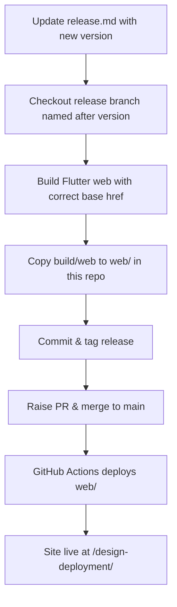

## Release & Deployment Process

1. **Update the Release Version**
   - Edit the `release.md` file to set the new, progressive version number for the upcoming release.

2. **Checkout a New Branch for the Release**
   - Name your branch according to the version number in `release.md` (e.g., `releases/v0.1.0`).

3. **Build the Flutter Web App from the Design System Project**
   - In your design system project, run:
     ```sh
     flutter build web --release --base-href "/design-deployment/"
     ```
   - This ensures all asset paths are correct for GitHub Pages at [https://dk070202.github.io/design-deployment/](https://dk070202.github.io/design-deployment/).

4. **Copy the Build Output**
   - Take the contents of `build/web` from your design system project.
   - Replace the `web/` folder in this repository (`design-deployment`) with those contents.

5. **Commit and Tag the Changes**
   - Commit the updated `web/` folder.
   - Create and publish a git tag matching the release version.

6. **Raise a Pull Request and Merge to Main**
   - Open a PR from your release branch to `main`.
   - After review, merge it.

7. **Automatic Deployment**
   - The GitHub Actions workflow in this repo will deploy the contents of `web/` to GitHub Pages.

8. **Access the Updated Project**
   - The latest version will be live at: [https://dk070202.github.io/design-deployment/](https://dk070202.github.io/design-deployment/)

---

### Example Diagram



> **Note:** The version number for each release should be progressive, meaning it must increment with every new release to ensure clear version tracking and avoid conflicts.
